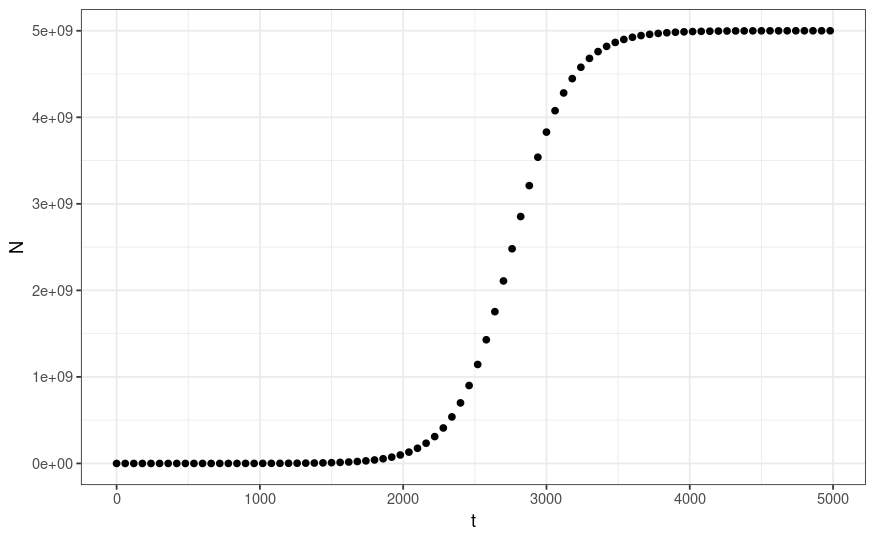
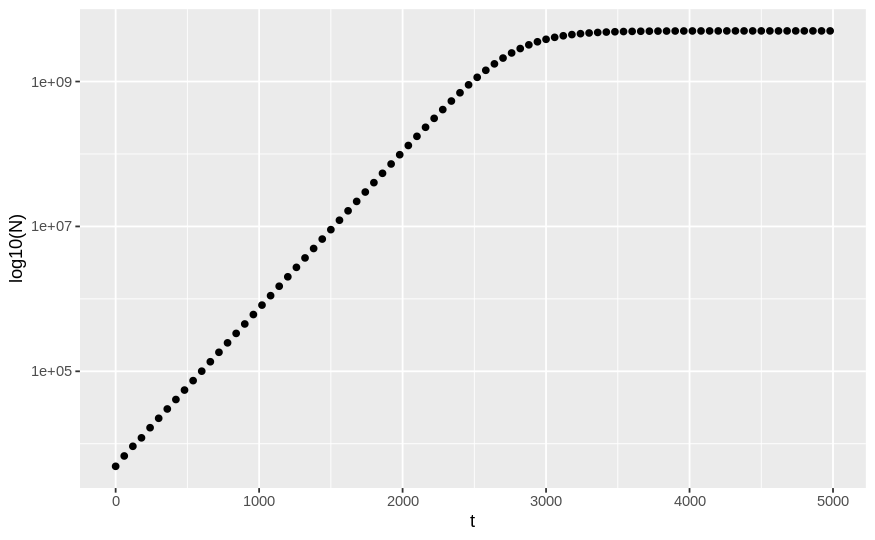
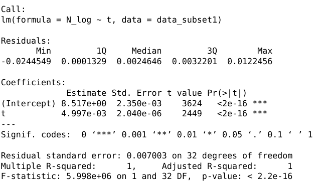
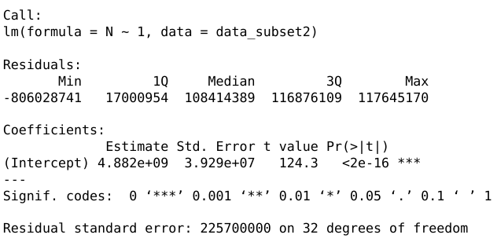
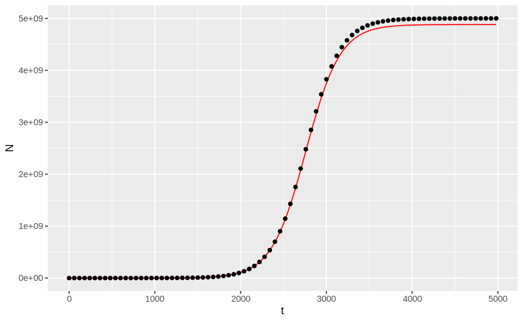
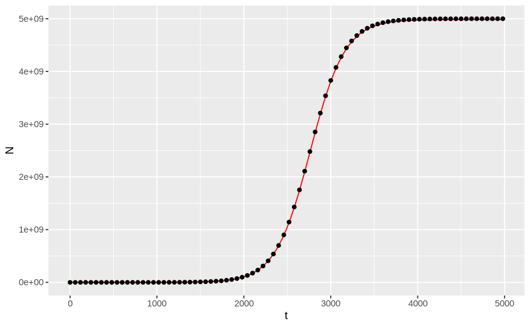
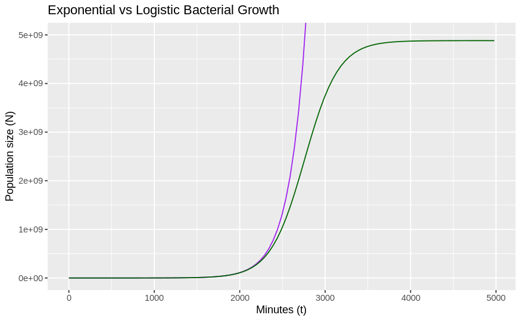
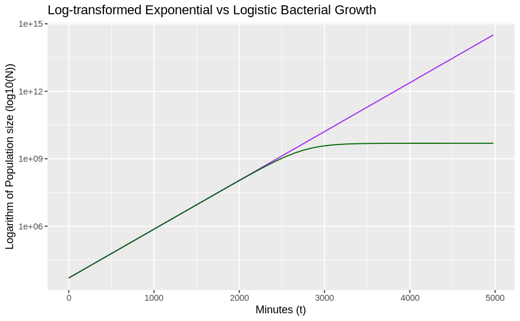

# An analysis of bacterial population growth 

## Question 1

**(10 points) Annotate the README.md file in your logistic_growth repo with more detailed information about the analysis. Add a section on the results and include the estimates for N0, r and K (mention which \*.csv file you used)**

### Introduction

In this analysis, our main objectives were to determine three properties of bacterial growth: the initial population size (N0), the rate of growth (r), and the carrying capacity (K).

100ul of an isolate of the bacterium *Escherichia coli* was suspended in 900ul of growth medium, totaling 1ml. The initial population size of the isolate, N0, is unknown. The initial abundance of growth medium (and its associated resources) allowed for exponential growth of the bacteria at the beginning, measured as the growth rate r. As the resources were depleted, the growth rate of the bacteria declined, until it reached equilibrium. This equilibrium is the carrying capacity, K.

If modeled on a graph, the resulting bacterial growth shape is sigmoid, as the bacteria grows in a logistic manner:

1)  There is an initial lag phase, as the bacteria must take time to adjust to its new environmental conditions, before it can begin its next phase: exponential growth (Rolph et al., 2012).

2)  During exponential growth, the bacteria are growing and dividing rapidly. They reach the maximum growth rate (r) during this phase, as the number of bacteria increases exponentially. The generation time is the time taken for a bacterial population to double in number. For *E. coli*, this is 20 minutes in laboratory conditions (Gibson, 2018).

3)  The population's growth rate per capita decreases the as population depletes the available resources in the growth medium and the population size approaches the carrying capacity (K). The carrying capacity is the maximum population size the environment can support given its limited resources. In the stationary phase at K, the number of cells dividing is equal to the number of cell deaths, and so the population remains at equilibrium.

4)  There is usually then a death phase, as the build up of toxic waste and the depletion of resources pushes the bacterial population into decline (Barer, 2012). However, the data for experiment 3 did not show this phase.

Whilst the three properties that we are interested in (N0, r and K) can be determined from a logistic growth model, they can more easily be determined by breaking the logistic growth down into two linear graphs. Let us move onto methods to see how this can be done.

### Methods

Firstly, I forked a repositary set up by the demonstrater called logistic_growth, so that I could have access to the data to work on myself (I worked on experiment 3). I then created a development branch called 'dev' so that any changes I made were not immediately changed on the main branch. This is important as any mistakes made will not affect the main branch. 

#### Install and load packages 

The data had to be loaded into the project, and the necessary packages installed and loaded.

```{r, include = FALSE, message=FALSE}
growth_data <- read.csv("experiment3.csv")

install.packages("ggplot2")
install.packages("dplyr")
library(ggplot2)
library(dplyr)
```

#### plot_data.R

The second piece of code that I worked on was to plot two graphs:

##### Graph 1:

The first showed the sigmoidal shape of the logistic bacterial growth. On the x-axis was time (t) and on the y-axis was the number of bacterial cells (N). The lag phase continued until around t2000, followed by exponential growth from t2000-3600, and finally the stationary phase from t3600 onwards.

Code:

```{r, results = 'hide'}
ggplot(aes(t,N), data = growth_data) +
  geom_point() +
  xlab("t") +
  ylab("N") +
  theme_bw()
```




##### Graph 2:

The second graph was a semilog-plot, where the x-axis was linear (time), and the y-axis was log-transformed (log10(N)). The shape in this graph was an increasing linear relationship from t0 to t3000, then the population size remains constant from t3000 onward.

Code:

```{r, results = 'hide'}
ggplot(aes(t,N), data = growth_data) +
  geom_point() +
  xlab("t") +
  ylab("log10(N)") +
  scale_y_continuous(trans='log10')
```



#### fit_linear_model.R

In the second part of this practical, I set up two linear models to estimate the three properties using the log-transformed second graph. 

##### Case 1

The first was set to when K >> N0, and t is small. This means that the population size is much lower than the carrying capacity, and so the population will show exponential growth. Time, t, is small to show that this is early in the bacterial growth. The rate of increase in this linear model is r. In this code, time is filtered to <2000 minutes, as at this point, t is relatively small and we can see that N0 is much lower than K. 

```{r, echo=TRUE, results='hide'}
data_subset1 <- growth_data %>% filter(t<2000) %>% mutate(N_log = log(N))

model1 <- lm(N_log ~ t, data_subset1)
summary(model1)
```

##### Case 2

Here I looked at the stationary phase of the logistic graph, again using a subset of the data to create a linear model. In this case, N(t) = K, as I wanted to look at the population size when it is at carrying capacity. By finding the y-intercept of this linear model, I could determine the carrying capacity (K). 

In this code, the data is subsetted to include all entries from after t3000, so that only the stationary phase is included. 

```{r, echo=TRUE, results='hide'}
data_subset2 <- growth_data %>% filter(t>3000)

model2 <- lm(N ~ 1, data_subset2)
summary(model2)
```

### Results

##### Case 1

The results of the first model are below:




The linearisation of the log of the first part of the model allows us to work out the initial population size (N0) and the growth rate (r). The intercept is log(N0) and the gradient is r. Therefore, from this model, we can derive that N0 is 5000.306 and r is 4.997e-03.


##### Case 2

The results of the second model follow:




When t>3000, the population has reached carrying capacity and so has plateaued at the maximum population size. In this case, K can be determined from the y intercept. The carrying capacity from this model is 4.882e+09.

Therefore, from these models we have derived the following parameters:

-   N0 = 5000.306

-   r = 4.997e-03

-   K = 4.882e+09


#### plot_data_and_model 

Finally, I plotted a model of the bacterial growth based on the parameters derived from the linear models (the code for which is shown below). The black dots indicate data points of the bacterial population size at time t, and the red line is the model created using my parameters.

```{r, results='hide'}
logistic_fun <- function(t) {
  N <- (N0*K*exp(r*t))/(K-N0+N0*exp(r*t))
  return(N)}

N0 <- 5000.306 
r <- 4.997e-03 
K <- 4.882e+09

ggplot(aes(t,N), data = growth_data) +
  geom_function(fun=logistic_fun, colour="red") +
  geom_point()
```


Whilst the two lines correlate well, they are not an exact match. My model provides an underestimate of the carrying capacity. To improve the fit between the two lines, the times by which the two models were filtered should be adjusted slightly: to ensure the exact time that the population reached the carrying capacity is used. 


I then adjusted the values of t in the two models to find the best fit of the model to the actual population growth. The values of t that resulted in the following graph were t<2000 in the first model, and t>3500 in the second. This suggests that the population had only reached carrying capacity by 3500 minutes. 




## Question 2

**(10 points) Use your estimates of N0 and r to calculate the population size at t = 4980 min, assuming that the population grows exponentially. How does it compare to the population size predicted under logistic growth?**

Determining N0 at t=4980

If population grows exponentially, then it follows the exponential growth formula N(t) = N0e^rt 

Using the parameters I obtained from the linear models, I can calculate the population size at t = 4980 min:

- t = 4980
- N0 = 5000.306 
- r = 4.997e-03 

```{r}
t <- 4980
N0 <- 5000.306 
r <- 4.997e-03 

Nt <- N0*exp(r*t) 
Nt
```
The resulting population at t = 4980 with exponential population growth is 3.209525e+14. 

If we calculate population size at t = 4980, given the effects of carrying capacity, we get a very different answer:   
```{r}
t <- 4980
N0 <- 5000.306 
r <- 4.997e-03 
K <- 4.882e+09

Numerator <- K*N0*exp(r*t)
Denominator <- K-N0+N0*exp(r*t)

Nt <- Numerator/Denominator
Nt
```
From this equation, I calculated that the bacterial population size at time t=4980 min is 4881925741, or 4.88e+09. 

The large difference between the two calculations is due to the absence of carrying capacity in the first equation. If we do not include this parameter, then the population can continue to grow in a seemingly infinite manner. There are no effects of resource depletion, toxic waste build up, or competition, as is seen when carrying capacity is introduced. This is unrealistic, and so the better estimation of population size at time t=4980 min is 4.88e+09. 


## Question 3

**Add an R script to your repository that makes a graph comparing the exponential and logistic growth curves (using the same parameter estimates you found). Upload this graph to your repo and include it in the README.md file so it can be viewed in the repo homepage**

The code for my graphs can be found in the file named Question3.R in this logistic_growth repository. They are shown below.





### References

Barer, M. R. (2012). Bacterial growth, physiology and death. Medical Microbiology. A Guide to Microbial Infections: Pathogenesis, Immunity, Laboratory Diagnosis and Control,, 39-53

Gibson, B., Wilson, D. J., Feil, E., & Eyre-Walker, A. (2018). The distribution of bacterial doubling times in the wild. Proceedings. Biological sciences, 285(1880), 20180789. <https://doi.org/10.1098/rspb.2018.0789>

Rolfe, M. D., Rice, C. J., Lucchini, S., Pin, C., Thompson, A., Cameron, A. D., Alston, M., Stringer, M. F., Betts, R. P., Baranyi, J., Peck, M. W., & Hinton, J. C. (2012). Lag phase is a distinct growth phase that prepares bacteria for exponential growth and involves transient metal accumulation. Journal of bacteriology, 194(3), 686--701. <https://doi.org/10.1128/JB.06112-11>
