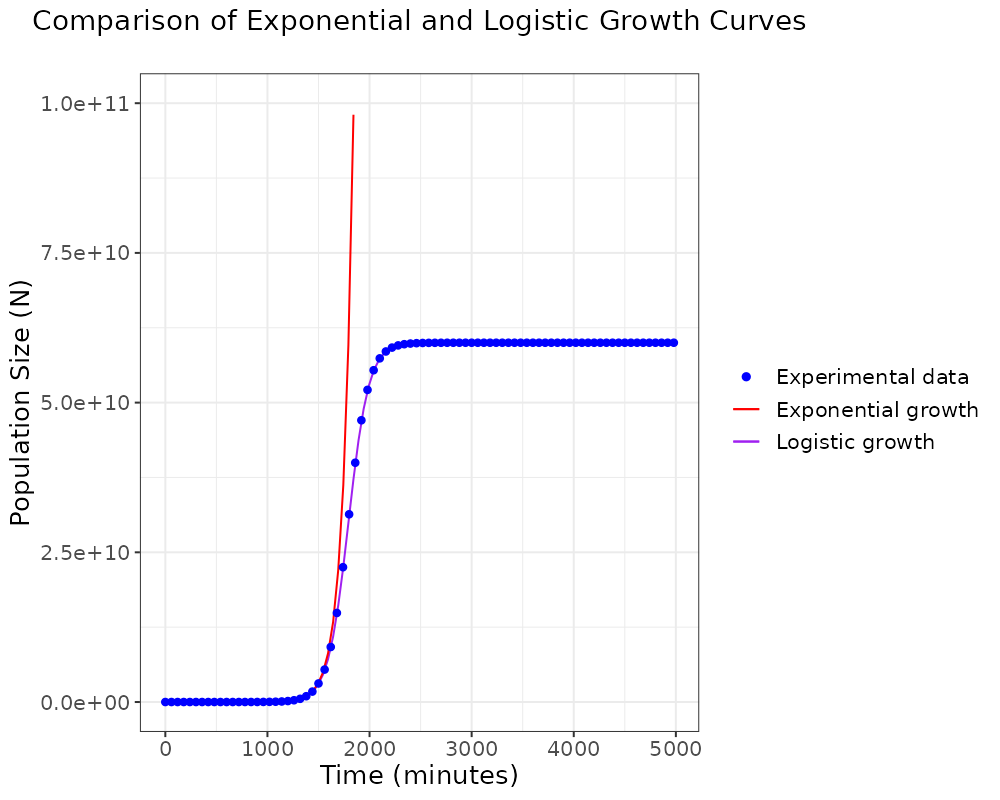

This repo contains statistical analysis for an experiment on bacterial population growth. In the experiment, we cultured bacteria by adding 100μl *Escherichia coli* isolate to 900μl growth media. Bacterial population size was measured and recorded at different time intervals after the experiment started. Initially, resources are abundant, so the population should show exponential growth. As time passes, resources in the culture are being used up, so population growth slows down and eventually reaches a threshold where the population no longer grows. This threshold is known as the carrying capacity, which is the maximum population size that the environment can support. Using this data, we were aiming to estimate the initial population size (*N0*), growth rate (*r*), as well as carrying capacity (*K*) of the bacterial population. 

#### Estimating N0, r, and K
In this analysis, I have used the **experiment1.csv** file as my experimental data.

To estimate N0 and r, we need to consider regions in the growth curve where the population grows exponentially. Exponential growth is observed at the early stages of the experiment, which means t is really small while K is much greater than N0. In this context, the exponential growth equation can be simplified as: 
$$N(t)=N_{0} \cdot e^{rt}$$

Logarithmic transformation of the exponential growth equation:
$$ln(N)=ln(N_{0})+r \cdot t \cdot ln(e)$$
Since ln(e) equals 1, this term is redundant and can be removed from the equation, so:
$$ln(N)=ln(N_{0})+r \cdot t$$

The simplified equation resembles the equation for a straight line:
$$y=ax+b$$
where a is the slope and b is the y-intercept. If we fit a linear model to the data, then *ln(N)* is the parameter y, *t* is the parameter x, *r* corresponds to the slope and *ln(N0)* is the y-intercept. 

Thus, to work out the estimates for N0 and r, we simply need to fit a linear regression model to the transformed data and look for the slope and the y-intercept. From the results of this linear model, we can know that:
$$N_{0}=e^{6.88} = 972.6$$
$$r=1 \times 10^{-2}=0.01$$

On the other hand, the value of K can be estimated by considering the limit where t tends to infinity. When t is large enough, the population size remains constant and approximates the carrying capacity. In this case, the logistic growth equation can be simplified to:
$$N(t)=K+0 \cdot t$$
Therefore, we can fit another linear model to the data by including only a subset of the data where t is large and modelling N(t) as a constant value. By doing this, we can get an estimated value of K, which is:
$$K=6 \times 10^{10}$$

### Calculating population size at t=4980min
If we assume that exponential growth is occurring at t=4980min, we will predict the population size to be:
$$N(4980) = 972.6 \cdot e^{0.01 \cdot 4980} = 4.12 \times 10^{24}$$

This value is much larger than the population size predicted under logistic growth (which is $6 \times 10^{10}$). Therefore, it is inappropriate to estimate population size at t=4980min using the exponential growth function, as growth has reached the plateau phase at this stage and approximates the carrying capacity of the population. 

### Plotting the two growth curves
We can generate a plot to compare the logistic growth curve and the exponential growth curve using the known parameters

