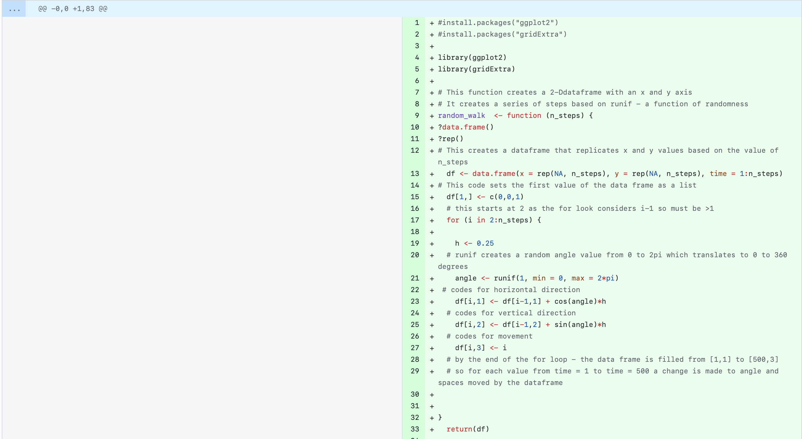
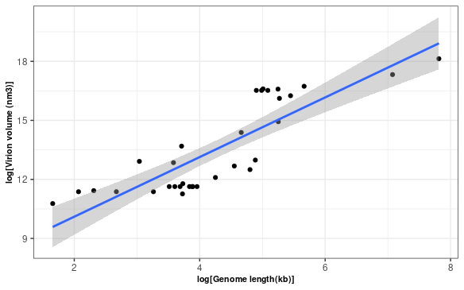

\# INSERT ANSWERS HERE \#

Q1-

This code models the growth of a culture of E.Coli It does this by estimating the rate of growth, starting population size and carrying capacity of the E.Coli

**First we used plot_data.R to create a graph of log(N) against t**

First I plotted the logistic growth data In plot_data.R we called the data from **experiment 1.csv** as growth_data)

I used the package ggplot2 to plot the time (t) against bacteria population (N) on a graph

After this I transformed the data so that we plotted time passed against the log function of number of bacteria. This was done to determine if we could observe a linear relationship between time passed and the log function of the number of species.

**Then we used fit_linear_model.R to determine our N0, r and k values given different conditions for t**

Under the first conditions N is very small compared to K

I used the linear model function (lm()) to determine the y intercept and gradient of a graph with certain conditions for t n and k. First I used a model where N \<\< K and where t is small. In this model we used t \< 300 and plotted t against log(N(t))

This gave us values for r and N0 which were as follows:

**RESULTS**

r = 0.013516 - which is our gradient

N0 = 6.8421256e - which is our y intercept

To determine the carrying capacity we looked at a scenario where t was large so that N(t) = k

We inputted t \>(3000) into our model and got this values

K = 6e\^10

**Then we used plot_data_and_model to input these values of N0,r and k into a linear model, confirming that they were the correct values**

when we did this - we observed the same graph as given by our data plot, confirming these values for N0,r and k.

Q2 -

The exponential graph gave a value of 2.289804exp(25) at t = 4980 -this is far larger than the size predicted at this time for logistic growth

Q3 -

{width="260"}

Q4 -

I observe that the code creates data frames that form plot lines color coded by t values. This plot lines follow on from each other, have a random starting point and move in random directions. Running the code more than once does not change the output of the random paths of the plot.

seed is a vector that sets an RNG containing integers. Random seed can take different values through set.seed(). Once the seed is set - the code will return the same output unless the code is restarted.

I was unable to get a comparision between the original and modified rscript as I worked in rstudio and imported my code.

{width="370" height="200"}

Q5 -

There are 34 rows and 13 columns

I can import the janitor package and clean the data so that there are no spaces. This will allow me to the data, calling the column names.

To determine the values for a and b - i transformed the data set into log(length) against log(volume).

Coefficients:

(Intercept) 7.0748

log_length 1.5152

so if we know that log(B) = c, a = m

our c is log length and our gradient is m which is 1.5152. c = exp(7.0748) = log(B).

So b = exp(7.0748) = 1181.807.

This lines up with table2 from the study on viruses as these figures round to those listed in the experiment.

Below is the recreation of the graph plotting the log of genome length against the log of the virion volume.

{width="343"}

I estimated the volume of a virion with length 300 Kb using a function with the equation -

v = b\*L\^a

this gave the value 6697006 nm3

Reproducibility refers to how simlar results are when other researchers can conduct the same analysis on a data frame as well as how easy it is to conduct the analysis. Replicability involves measures the additional component of how easy it is for researchers to collect and a new data set and run the analysis for a complete repeat of the experiment. Github allows the retention of previously made code so that other researchers may reproduce data. It also provides researchers the ability to run code made by others . This is limited as it is difficult for github to improve repeatibility of experiments as collection of a new data set cannot be assisted through github.
